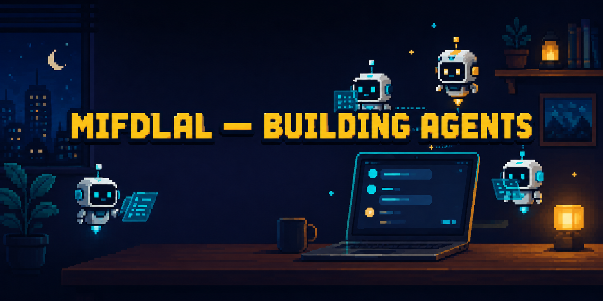

  <!-- Banner pixel-art (ChatGPT) + teks "MIFDLAL — BUILDING AGENTS".
       Full-width responsif. Mau ganti? ganti file assets/banner.png. -->
  

  
  &nbsp;
  
  &nbsp;
  

---

## The short version

Websites got cheap. Everyone ships a landing page. What *isn't* cheap is an agent that does the boring work for you — triaging, replying, routing, posting, monitoring — without a human in the loop for every step.

That's the direction I'm heading: **AI-agent and automation systems**, not brochure sites. Still early — but building in public.

## What I'm learning to build

I'm getting hands-on with agent workflows and automations. The toolbox I'm exploring:

- **n8n** — visual workflows that connect your SaaS, APIs, and databases into one pipeline
- **OpenClaw / Hermes** — agent runtimes for tasks that need reasoning, not just if/else
- **Bots** — Telegram / WhatsApp / Discord assistants that talk to your users *and* your backend
- **Prompt engineering** — the part everyone skips: making the model *reliable*, not just clever
- **AI-agent automation** — glue it all together so the agent *acts*, not just answers

If it can be automated without you touching it, I want to build it.

## How I think about it

1. **Boring beats clever.** A workflow that runs 1,000× a day and never surprises you > a demo that wows once.
2. **The prompt is the product.** Most "AI doesn't work" is just unengineered prompts. I treat prompts like code.
3. **Human-in-the-loop only where it hurts.** Automate the 95%, keep a person for the 5% that matters.
4. **It has to survive me.** If you can't run or tweak it after I'm gone, I failed.

## Currently poking at

Distributed systems fundamentals, tRPC, and pushing agents from "answers questions" to "gets things done." Always learning the next runtime.

## Talk to me

Freelance automation, agent builds, or a "can this even be automated?" question — [email me](mailto:mifdlaltsaqibalf26@outlook.com). I'm in Bandung (WIB, UTC+7), usually around 8 PM–1 AM, which lines up with US mornings and EU afternoons.

Building agents from Bandung, Indonesia · <a href="https://www.mtadevworks.web.id/">mtadevworks.web.id</a>
