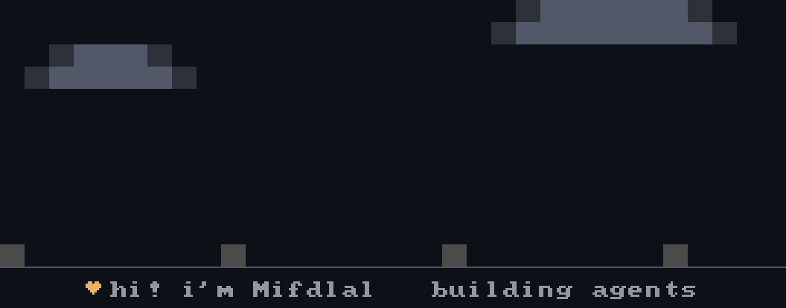

  <!-- Live banner: regenerated nightly by awan (codewithwan/awan). Edit awan.json to change it. -->
  

---

##  My Stack

  

  
  &nbsp;
  
  &nbsp;
  
  &nbsp;
  
  &nbsp;
  
  &nbsp;
  
  &nbsp;
  

##  Connect

  
  &nbsp;
  
  &nbsp;
  

Building agents from Bandung, Indonesia · <a href="https://www.mtadevworks.web.id/">mtadevworks.web.id</a>
